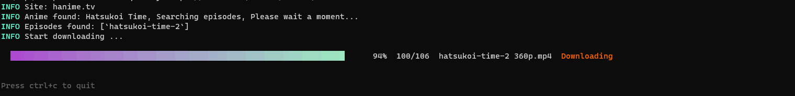
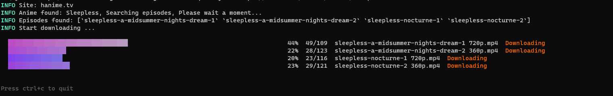

# hanime-hunter


English | [简体中文](./README_ZH_CN.md)

A CLI app to download HAnime.

If you like this repo, please consider giving it a star (o゜▽゜)o☆ . Thank you OwO.

> Random Wink OvO

<!-- If you want to deploy your own service for random waifu. Check: https://github.com/dreamjz/waifu-getter -->


<br />

<!--
  If you want to use your own Moe-Counter
  please refer to the tutorial
  in its original repo: https://github.com/journey-ad/Moe-Counter
  and deploy it to the Replit or Glitch
-->


## Choose your faction

Check [here](https://github.com/acgtools/hanime-hunter/issues/3) and chooes a reaction:  Pure Love Knight ❤️, NTR Warrior：🚀

  

<!--ts-->

* [hanime-hunter](#hanime-hunter)
   * [Choose your faction](#choose-your-faction)
   * [Installation](#installation)
      * [Using go](#using-go)
      * [Download from releases](#download-from-releases)
   * [Supported Site](#supported-site)
   * [Community](#community)
   * [Quick Start](#quick-start)
      * [Prerequisites](#prerequisites)
         * [Ensure that your terminal charset is UTF-8](#ensure-that-your-terminal-charset-is-utf-8)
         * [FFmpeg](#ffmpeg)
      * [Command Help](#command-help)
         * [Download](#download)
   * [Hanime1me](#hanime1me)
      * [Only one episode](#only-one-episode)
      * [Full series based on the specified episode](#full-series-based-on-the-specified-episode)
         * [Skip downloaded files](#skip-downloaded-files)
      * [Download playlist](#download-playlist)
      * [Specify the output directory](#specify-the-output-directory)
      * [Specify the quality](#specify-the-quality)
      * [Get info only](#get-info-only)
   * [Hanimetv](#hanimetv)
      * [Only one episode](#only-one-episode-1)
      * [Full series based on the specified episode](#full-series-based-on-the-specified-episode-1)
         * [Skip downloaded files](#skip-downloaded-files-1)
      * [Download playlist](#download-playlist-1)
      * [Specify the output directory](#specify-the-output-directory-1)
      * [Specify the quality](#specify-the-quality-1)
      * [Get info only](#get-info-only-1)
   * [Issue](#issue)
   * [Star History](#star-history)

<!--te-->

## Installation

### Using `go`

```sh
$ go install -ldflags "-s -w" github.com/acgtools/hanime-hunter@latest
```

### Download from releases

[release page](https://github.com/acgtools/hanime-hunter/releases)

## Supported Site

> **NSFW** Warning, the following site may contain sensitive content.

| Site       | Language | Episode | Series | Playlist | Status    |
| ---------- | -------- | ------- | ------ | -------- | --------- |
| hanime1.me | Chinese  | ✓       | ✓      | ✓        | Available |
| hanime.tv  | English  | ✓       | ✓      | ✓        | Available |

## Community

[Discord](https://discord.gg/rrJQWNFa)

## Quick Start

### Prerequisites

#### Ensure that your terminal charset is UTF-8

**Windows**

```cmd
> chcp
Active code page: 65001

# if code page is not 65001(utf-8), change it temporarily
> chcp 65001
```

If you want to set the default charset, follow the steps:

1. Start -> Run -> regedit
2. Go to `[HKEY_LOCAL_MACHINE\Software\Microsoft\Command Processor\Autorun]`
3. Change the value to `@chcp 65001>nul`

If `Autorun` is not present, you can add a `New String`.

This approach will auto-execute `@chcp 65001>nul` when `cmd` starts.

**Linux**

```sh
$ echo $LANG
en_US.UTF-8
```

#### FFmpeg

- [FFmpeg](https://www.ffmpeg.org/)

### Command Help

```sh
$ hani -h
HAnime downloader. Repo: https://github.com/acgtools/hanime-hunter

Usage:
  hani [command]

Available Commands:
  dl          download
  help        Help about any command
  version     Print version info

Flags:
  -h, --help               help for hani
      --log-level string   log level, options: debug, info, warn, error, fatal (default "info")

Use "hani [command] --help" for more information about a command.
```

#### Download

```sh
$ hani help dl
download

Usage:
  hani dl [flags]

Flags:
  -h, --help                help for dl
  -i, --info                get anime info only
      --low-quality         download the lowest quality video
  -o, --output-dir string   output directory
  -q, --quality string      specify video quality. e.g. 1080p, 720p, 480p ...
      --retry uint8         number of retries, max 255 (default 10)
  -s, --series              download full series

Global Flags:
      --log-level string   log level, options: debug, info, warn, error, fatal (default "info")
```

## Hanime1me

### Only one episode

The default quality will be the highest quality.

```sh
# Download from the watch page
# The anime will be saved in ./anime_series_title/
$ hani dl https://hanime1.me/watch?v=xxxx
```


### Full series based on the specified episode

```sh
# Download the full series
# E.g. If you provide the link of the Anime_Foo_02
# then the full series of Anime_Foo will be downloaded (Anime_Foo_01, Anime_Foo_02, ...)
$ hani dl -s https://hanime1.me/watch?v=xxxx
```


#### Skip downloaded files

If some files get stuck during downloading, stop the program and then restart the download.

It will skip the files that have already been downloaded.


### Download playlist

```sh
$ hani dl https://hanime1.me/playlist?list=xxxx
```


### Specify the output directory

```sh
# The anime will be saved in output_dir/anime_series_title/
$ hani dl -o <output_dir>
```

### Specify the quality

```sh
# You can specify the quality of video
# if it is not exist, the default (highest quality) will be downloaded
$ hani dl -q "720p" https://hanime1.me/watch?v=xxxx
```

### Get info only

```sh
# Get only the downloadable video info:
# title, quality, file extension
$ hani dl -i https://hanime1.me/watch?v=xxxx
```

## Hanimetv
### Only one episode

The default quality will be the highest quality.

```sh
# Download from the watch page
# The anime will be saved in ./anime_series_title/
$ hani dl https://hanime.tv/videos/hentai/xxx
```



### Full series based on the specified episode

```sh
# Download the full series
# E.g. If you provide the link of the Anime_Foo_02
# then the full series of Anime_Foo will be downloaded (Anime_Foo_01, Anime_Foo_02, ...)
$ hani dl -s https://hanime.tv/videos/hentai/xxx
```



#### Skip downloaded files

If some files get stuck during downloading, stop the program and then restart the download.

It will skip the files that have already been downloaded.

### Download playlist

```sh
$ hani dl https://hanime.tv/playlists/xxxx
```


### Specify the output directory

```sh
# The anime will be saved in output_dir/anime_series_title/
$ hani dl -o <output_dir>
```

### Specify the quality

```sh
# You can specify the quality of video
# if it is not exists, the default (highest quality) will be downloaded
$ hani dl -q "720p" https://hanime.tv/videos/hentai/xxx
```

### Get info only

```sh
# Get only the downloadable video info:
# title, quality, file extension
$ hani dl -i https://hanime.tv/videos/hentai/xxx
```


## Issue

Feel free to create issues to report bugs or request new features.

## Star History

[](https://star-history.com/#acgtools/hanime-hunter&Date)
