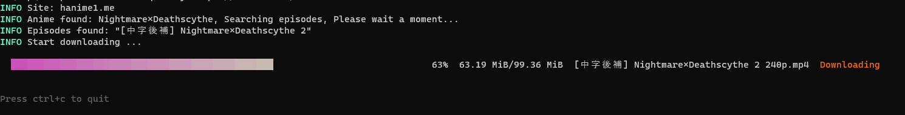
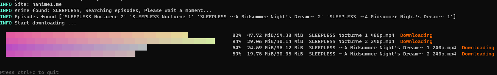
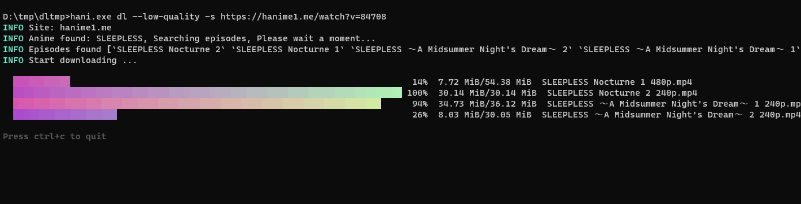
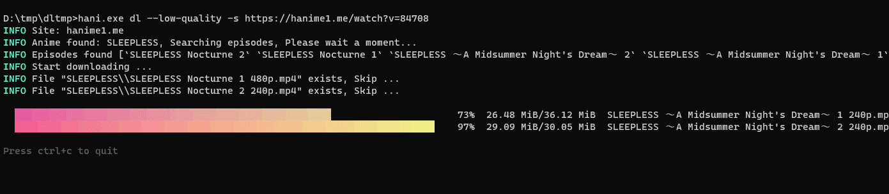
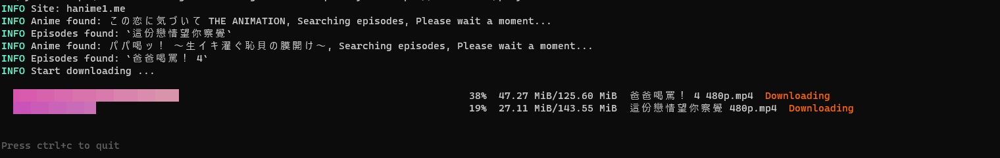
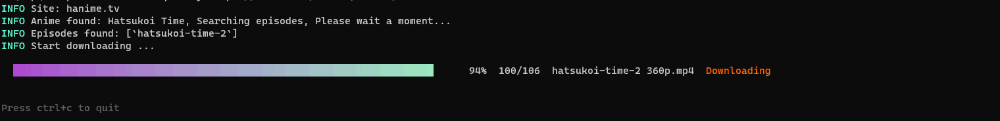
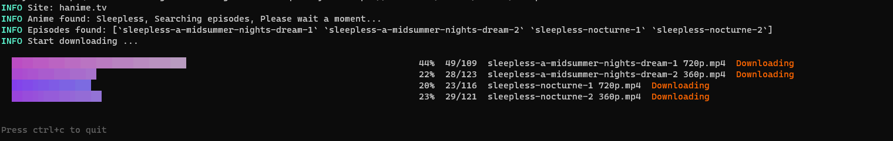
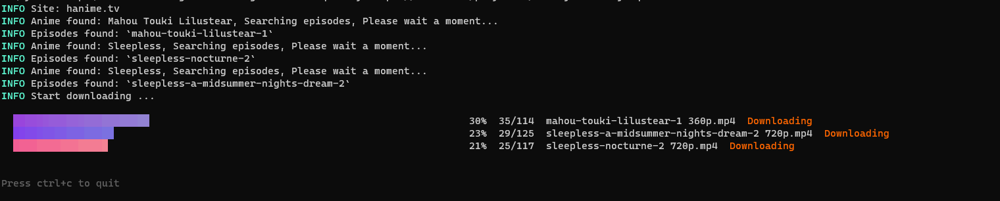

# hanime-hunter

用于下载里番的 CLI 工具。

如果这个程序对你有所帮助，可以帮忙给一个 star (o゜▽゜)o☆ ，谢谢 OwO。

> 随机 Wink OvO

<!-- If you want to deploy your own service for random waifu. Check: https://github.com/dreamjz/waifu-getter -->


<br />

<!--
  If you want to use your own Moe-Counter
  please refer to the tutorial
  in its original repo: https://github.com/journey-ad/Moe-Counter
  and deploy it to the Replit or Glitch
-->


## 选择你的阵营

点击 [这里](https://github.com/acgtools/hanime-hunter/issues/3) 然后选择一个表情：纯爱战士 ❤️, 牛头人：🚀

  

* [hanime-hunter](#hanime-hunter)
   * [安装](#安装)
      * [使用 go](#使用-go)
      * [从 releases 页面下载](#从-releases-页面下载)
   * [支持的网站](#支持的网站)
   * [社区](#社区)
   * [快速开始](#快速开始)
      * [前提条件](#前提条件)
         * [确保你的终端字符集为 UTF-8](#确保你的终端字符集为-utf-8)
      * [Command Help](#command-help)
         * [Download](#download)
   * [Download](#download-1)
      * [只下载一个视频](#只下载一个视频)
      * [下载整个系列](#下载整个系列)
         * [跳过已下载的文件](#跳过已下载的文件)
      * [下载播放清单](#下载播放清单)
      * [指定输出路径](#指定输出路径)
      * [指定画质](#指定画质)
      * [只获取可下载的文件信息](#只获取可下载的文件信息)
   * [Issue](#issue)
   * [Star History](#star-history)

## 安装

### 使用 `go`

```sh
$ go install -ldflags "-s -w" github.com/acgtools/hanime-hunter
```

### 从 releases 页面下载

[release page](https://github.com/acgtools/hanime-hunter/releases)

## 支持的网站

> **NSFW** 警告, 以下站点包含敏感内容.

| Site       | Language | Episode    | Series   | Playlist | Status        |
| ---------- | -------- | ---------- | -------- | -------- | ------------- |
| hanime1.me | 中文     | ✓          | ✓        | ✓        | Available     |
| hanime.tv  | English  | Developing | Planning | Planning | Not Available |

## 社区

[Discord](https://discord.gg/e78WnwYq)

## 快速开始

### 前提条件

#### 确保你的终端字符集为 UTF-8

**Windows**

```cmd
> chcp
Active code page: 65001

# if code page is not 65001(utf-8), change it temporarily
> chcp 65001
```

如果你想修改默认的字符集, 按照以下步骤:

1. 开始 -> 运行 -> regedit
2. 找到 `[HKEY_LOCAL_MACHINE\Software\Microsoft\Command Processor\Autorun]`
3. 将其值修改为 `@chcp 65001>nul`

如果 `Autorun` 不存在, 你可以创建一个新的字符串类型的键值对.

此方法将在`cmd` 启动时自动执行 `@chcp 65001>nul`。

**Linux**

```sh
$ echo $LANG
en_US.UTF-8
```

### FFmpeg

- [FFmpeg](https://www.ffmpeg.org/)

### Command Help

```sh
$ hani.exe -h
HAnime downloader. Repo: https://github.com/acgtools/hanime-hunter

Usage:
  hani [command]

Available Commands:
  dl          download
  help        Help about any command
  version     Print version info

Flags:
  -h, --help               help for hani
      --log-level string   log level, options: debug, info, warn, error, fatal (default "info")

Use "hani [command] --help" for more information about a command.
```

#### Download

```sh
$ hani help dl
download

Usage:
  hani dl [flags]

Flags:
  -h, --help                help for dl
  -i, --info                get anime info only
      --low-quality         download the lowest quality video
  -o, --output-dir string   output directory
  -q, --quality string      specify video quality. e.g. 1080p, 720p, 480p ...
  -s, --series              download full series

Global Flags:
      --log-level string   log level, options: debug, info, warn, error, fatal (default "info")
```

## Hanime1me

### 只下载一个视频

默认下载最高画质。

```sh
# 从观看页下载
# 视频会保存在 ./番剧名称/
$ hani dl https://hanime1.me/watch?v=xxxx
```



### 下载整个系列

```sh
# 下载整个系列
# E.g. 比如你给的 Anime_Foo_02 的链接
# 会将 Anime_Foo 整个系列全部下载下来 (Anime_Foo_01, Anime_Foo_02, ...)
$ hani dl -s https://hanime1.me/watch?v=xxxx
```



#### 跳过已下载的文件

如果下载时有些文件卡住了，可以停止程序，然后重新开始下载。

已经完成的文件会被跳过。





### 下载播放清单

```sh
$ hani dl https://hanime1.me/playlist?list=xxxx
```



### 指定输出路径

```sh
# The anime will be saved in output_dir/anime_series_title/
$ hani dl -o <output_dir>
```

### 指定画质

```sh
# 你可以指定画质
# 如果指定的画质不存在，默认下载最高画质
$ hani dl -q "720p" https://hanime1.me/watch?v=xxxx
```

### 只获取可下载的文件信息

```sh
# 获取下载文件信息:
# 标题, 画质, 文件类型
$ hani dl -i https://hanime1.me/watch?v=xxxx
```

## Hanimetv
### Only one episode

The default quality will be the highest quality.

```sh
# Download from the watch page
# The anime will be saved in ./anime_series_title/
$ hani dl https://hanime.tv/videos/hentai/xxx
```



### Full series based on the specified episode

```sh
# Download the full series
# E.g. If you provide the link of the Anime_Foo_02
# then the full series of Anime_Foo will be downloaded (Anime_Foo_01, Anime_Foo_02, ...)
$ hani dl -s https://hanime.tv/videos/hentai/xxx
```



#### Skip downloaded files

Not supported

### Download playlist

```sh
$ hani dl https://hanime.tv/playlists/xxxx
```



### Specify the output directory

```sh
# The anime will be saved in output_dir/anime_series_title/
$ hani dl -o <output_dir>
```

### Specify the quality

```sh
# You can specify the quality of video
# if it is not exists, the default (highest quality) will be downloaded
$ hani dl -q "720p" https://hanime.tv/videos/hentai/xxx
```

### Get info only

```sh
# Get only the downloadable video info:
# title, quality, file extension
$ hani dl -i https://hanime.tv/videos/hentai/xxx
```


## Issue

欢迎创建 issue 来报告 bug 或者 请求添加新特性。

## Star History

[](https://star-history.com/#acgtools/hanime-hunter&Date)
